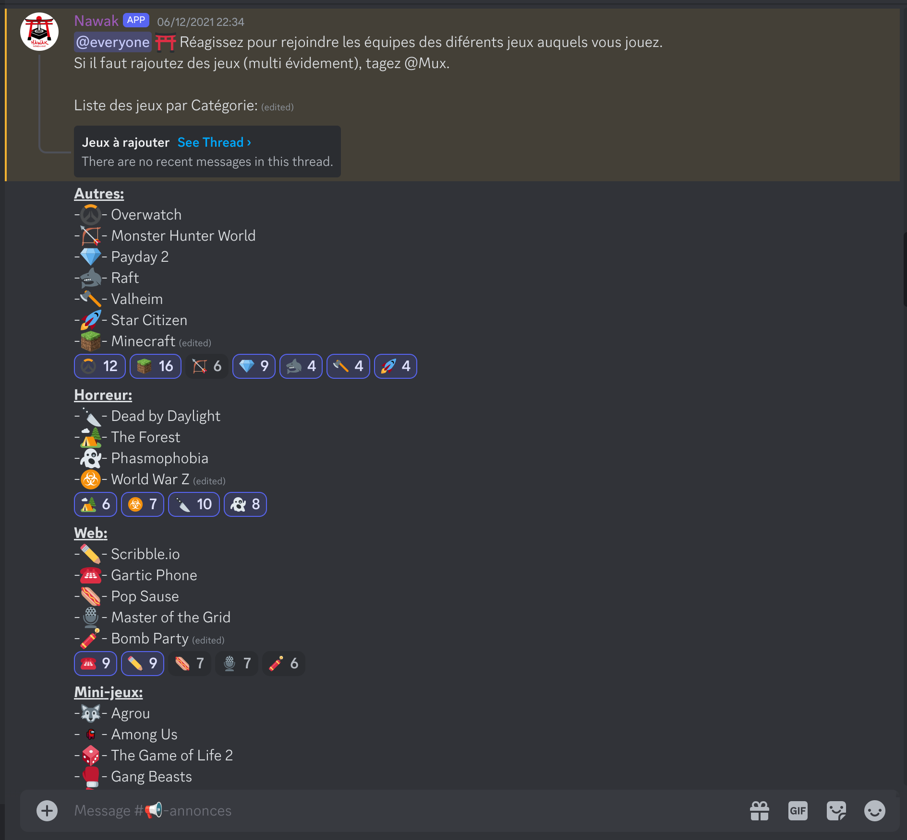
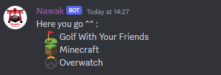

## Hours recap

| activity | theme | real hours | validated | start | end |
| --- | --- | ---:| ---:| --- | --- |
| [Catch the flag 2021](#catch-the-flag) | ctf | 12h | 10h | 2022/02/26 | 2022/02/26 |
| [Hackaton 2022](#hackaton) | hachaton | 48h | 10h | 2022/10/28 | 2022/10/30 | 
| [Discord Bot](#discord-bot) | API | 35~40h | 10h | 2021/12/? | 2023/02/16 |
| [Lab power supply](#lab-power-supply) | electronic | 12h | 10h | 2020/?/? | 2024/04/7 |
| [Nuke plugin](#nuke-plugin) | scripting | 6h | 6h | 2024/04/9 | 2024/04/9 |
| [Raspberry Minecraft server](#raspberry-minecraft-server) | admin | ~20h | 10 | 2022/?/? | present |

*total: 56h(~140h)*

## Honorable mentions

### Tetris
I have an ongoing project of implementing a version of Tetris in every language I mastered. I had made a version of it using python, sadly it was lost in a spring cleaning of my hard drives. I will make it again but I do not currently have the time.

### Forging mechanics
A friend had an idea for a video game in which the player played as a blacksmith. He wanted a system that could simulate the behavior of hot metal when struck with a hammer.
I designed for him the algorithm to be used. I however did not yet have the time to implement it.

### pc upgrades
I seem to be the default nerd for my friends when they need advice choosing computer parts. I helped my mother choose a laptop, I build and picked the parts of a desktop for a friend, troubleshooted the laptop of my brother.  

I seem to do a lot of boring it for friends and family. But I do not see it as a reflection of EPHEC skills, so it is not proposed for the hours count.

## Details

### Catch the flag
The catch the flag was my first group activity. I went with friends and at first, I only went for the hours but I took to the game, and found it really fun. I am glad that I participated in my first year, it allowed me to see all the subjects I would interact with in the coming years. The fact that I went with friends meant I had a lot of fun poking around at problems during the event.

Sadly I no longer have access to the score of my group. But, if memory serves, we were not last but not far from it. Luckily, I dont recall being saddened by it, I remember feeling happy we went this far (being noobies and all).

I am now glad to report that I am quite sure we would have a much better score if we were to do it again.

<details markdown="block">
<summary>proof</summary>

{: .page}
</details>

### Hackaton
In October of 2022 I participated in an Hackaton at EPHEC-LLN on the subject of green development. The objective was to come up with and idea of app/website that would help solve an issue liked with sustainable development. The idea we came up with was a website that would be a News source but only showing positive articles. To reduce the need for administrators and content managers, we planned the site to work by crowd sourcing the articles and the moderation. A bit like Wikipedia. In the end we produced a prototype website, but it failed to gain us the first place. This event reminded me a lot of a Game-jam I did a few years ago. The development was a lot of fun but the opportunities for activities and collaboration even between teams was quite amazing.

It was really interesting to have the perspective of a marketing student while discussing features and the idea itself. Their insight was enlightening and their tips for presenting will stay with me.

<details markdown="block">
<summary>proof</summary>

{: .page}
</details>

### Discord bot
Initially developed during the revisions of the January exams. The idea was to create a bot that could be customized to recognize multiple commands. The one I was most interested in was a command that would allow people se see what multiplayer games they had in common. To do that Everyone on the server votes to tell the bot what games they have (and are willing to play with others). The vote uses the reactions to messages that are maintained and updated by the bot.



When users vote, the bot keeps track internally of who plays what in memory. From then on, when two or more users want to play together, they can call `*wtp <@user1> <@user2>` and the bot will list all games in common:



to keep the chat neat, the message containing the command is deleted by the bot, and the response given will be removed after 5 minutes.

When embarking on this project, I was not familiar with API work. It was really interesting to navigate the existing data structures and hooks of discord to create this bot. It was also a good opportunity to better my python, which was not amazing at the time.

I am really proud of how it turned out, I made the bot with extendability in mind so each command the users can use. To add a new command, it is as easy as adding the new file with the command to the command directory and updating the command list in `data/command.csv`.
The command file should at minimum contain:
- A comment at the first line of the file. From the first line, each consecutive comment line is considered part of the 'man' for that command and will be displayed to users when they enter `*help <name of a command>`.
- a function to call when calling the command. the convention is ``<command keyword>_C`. It is not ideal, but it is what I chose at the time.

The update of the `command.csv` is necessary to tell the bot exactly what command exist and where they can be found. It is also there that, the permissions for the command are set as follows:
```
#name, #ref, #perm
help, commands.manual.help_C, @everyone
games, commands.games.games_C, @everyone
wtp, commands.wtp.wtp_C, @everyone
ip, commands.get_ip.get_ip_C, @IP-getter
```
The permission field can hold two types of values depending on the first character. If it is a `@` the command can only be used by members of that team. However, if it is a `#` then only the user tag specified can use it.  

This project was also the first time I worked with asynchronous functions. It was even a source of problem for the callback style I used for the commands.
The same behavior that is so useful when expending the command set but a pain when working out how data will flow to and from the functions when they are called. In the end I settled for a redundant approach.
Each command is given a array of all arguments used in the call to the command (like argc in C), but they are also passed the original message object, in case they need to access it or it's info directly.

This approach allowed for make lightweight command by only using the args, but also gives other more complex commands the versatility of using the message object.

The bot is normally always on on my discord server but for now the raspberry used to host it serves other purposes.

[git repository](https://github.com/mux99/Nawak-Bot)

*note: Reader, I would be delighted to discuss it further with you if you are interested ^^*

### Lab power supply
This is a short project for which advancements where made very slowly over time, one hour here, half an hour there. The goal was to convert an old PC power supply I had lying around, and convert it to a lab power supply that could output, 12 and 5 volts. It was not a difficult project by any stretch of the imagination, but it was one of the more relaxing ones.

I began with a standard atx power supply, I cut all atx connectors, removed the aluminum box and carefully removed all the redondent cables, for exemple the ground had more or less 20 cables, where I only need one.

I felt i needed a new box, so I made one out of acrylic panes. The preparation of the acrylic was the most time consuming. I ordered it in a big pane of 50cm by 50cm. The cutting process is long with a simple exacto blade, but it makes for nicer cuts.

The last thing to do was to install all the banana-plug connectors for the different voltages, as well as two buttons for on and off.


### Nuke plugin
A friend of mine is doing animation as part of his studies. He needed a script to help in the process of setting up layers of a mat painting in order to animate the parallax.

It was quite entertaining to spend a day learning about the process of animation in order to pull of the script.
The goal of the script is to extract the layers of the file given and prepare each of them like bellow.


Nuke uses a graph to represent the properties of objects in the scene. The script create and links those nodes like bellow.


I did not invent the method, I just had to follow a tutorial for the method to use [here](https://www.youtube.com/watch?v=feANAsdahRk). The hard part was the unclear documentation for the scripting process. 
This project was a welcome distraction in the hectic process of finishing the various projects of this end of year.

<details markdown="block">
<summary>script</summary>

```python
import nuke
import nukescripts.psd
import re

def purgeChilds(parent, keep=[]):
    out = False
    for node in parent.dependent():
        if re.sub(r'\d+$', '', node.name()) in keep:
            purgeChilds(node, keep)
            out = True
        else:
            keep = purgeChilds(node, keep)
            if not keep:
                nuke.delete(node)
    return out

def getChilds(parent, nodeType=""):
    if len(parent.dependent()) == 0:
        return []
    out = []
    for node in parent.dependent():
        if re.sub(r'\d+$', '', node.name()) == nodeType:
            out.append(node.name())
        out += getChilds(node, nodeType)
    return out


def run():
    nodes = nuke.selectedNodes()
    read = None
    camera = None
    for node in nodes:
        if re.sub(r'\d+$', '', node.name()) == "Read":
            read = node
        elif re.sub(r'\d+$', '', node.name()) == "Camera":
            camera = node

    if read is None or camera is None:
        nuke.message("Please select a Camera and a Read node.")

    nukescripts.psd.breakoutLayers(read)
    purgeChilds(read, ["Shuffle"])

    scene = nuke.createNode('GeoScene', inpanel=False)
    scene.setXpos(read.xpos())
    scene.setYpos(read.ypos() + 600)

    haperture = camera['haperture'].value()
    shuffles = getChilds(read, "Shuffle")
    for n in range(len(shuffles)):
        shuffle = nuke.toNode(shuffles[n])
        premult = nuke.createNode('Premult', inpanel=False)
        premult.connectInput(0, shuffle)
        premult.setXpos(shuffle.xpos())
        premult.setYpos(shuffle.ypos() + 50)
        
        crop = nuke.createNode('Crop', inpanel=False)
        crop.setInput(0, premult)
        crop.setXpos(premult.xpos())
        crop.setYpos(premult.ypos() + 50)

        card = nuke.createNode('GeoCard', inpanel=False)
        card.connectInput(0, crop)
        card.setXpos(crop.xpos())
        card.setYpos(crop.ypos() + 50)
        card['lens_in_focal'].setValue(haperture)
        card['lens_in_haperture'].setValue(haperture)
        card['z'].setValue((n*100)+100)
        scene.setInput(scene.inputs(), card)

    scan = nuke.createNode('ScanlineRender2', inpanel=False)
    scan.connectInput(0, camera)
    scan.connectInput(1, scene)
    scan.setXpos(scene.xpos() - 50)
    scan.setYpos(scene.ypos() + 100)
    camera.setXpos(scene.xpos() - 100)
    camera.setYpos(scene.ypos())
```

</details>

### Raspberry Minecraft Server
In 2022, I got back to playing Minecraft, and wandered if I could host my own server. I already had a raspberry 4B which is powerful enough to run it. Installing a Minecraft server on Linux was easy enough, the part I spent the most time on what the writing of the scripts used to launch and backup the server. Sadly since I repurposed the SSD used by the server earlier this year, I lost the scripts and the world save.

The backup script was smart enough to keep track of previous backup across multiple worlds. So if I swapped the curent world with another script, the backup process would adapt.

In the most advanced version I made, the script behaved like a system command which wen started would prompt the user to choose what they want to do (start, stop, backup, world change, etc.), the script would then continue asking for relevant information and perform the task. 

At the moment the server is completely gone, I have plans to revive it in the summer but I need the raspberry for other tasks at the moment.

*note: \<to future me\>, the minecraft wiki has a great tutorial for the basis of the scripts* [here](https://minecraft.wiki/w/Tutorials/Setting_up_a_server)